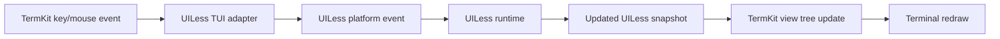

# TUI Platform White Paper

This document frames the plan for adding a macOS command-line TUI platform to
UILess. The current decision is to use TermKit for the first implementation,
while preserving the option to add a CSS-like styling/theme layer inspired by
Textual later.

## Goal

The Phase I macOS command-line target should be visual, event-driven, and useful
as a first-class UILess platform. It should not be treated as a debug-only
console shell.

Milestone 1 for the TUI platform:

- Start a UILess program from the command line.
- Render the first UILess view in a terminal.
- Accept keyboard events.
- Translate terminal events into UILess platform-independent events.
- Route UILess state changes back into the rendered TUI.
- Keep unit tests in place for the core translation layer.
- Keep the platform bridge independent from TermKit types in the UILess core.

## Candidate 1: TermKit

TermKit is a Swift terminal UI toolkit by Miguel de Icaza. Its README describes
it as a Swift port/evolution of the `gui.cs` console UI library, with a more
Unix-centric/UIKit-centric design direction. It is implemented in Swift and is
intended to work on Mac, Linux, and Windows.

TermKit is already close to the platform we need for Phase I:

- It is Swift-native.
- It has an application object, top-level views, windows, controls, layout,
  menus, dialogs, mouse handling, keyboard handling, and terminal drivers.
- It supports multiple drivers: curses, raw Unix ANSI, TTY debug output, and
  Windows console.
- It has a TTY driver that can emit plain text output for testing and debugging.
- It uses a responder-style event system with focused views, hot keys, cold
  keys, mouse enter/leave, and mouse event handling.

The most important TermKit concept for UILess is the responder chain. Controls
and views can process input through methods such as:

- `processHotKey(event:)`
- `processKey(event:)`
- `processColdKey(event:)`
- `mouseEvent(event:)`
- `mouseEnter(event:)`
- `mouseLeave(event:)`

This is event-driven, but it is more UIKit/AppKit responder-chain style than
Textual message-pump style. Individual controls expose closures for common
events. For example, `Button` has a `clicked` closure and raises it from
keyboard, hot-key, default-button, and mouse paths.

TermKit also has an application loop that routes keyboard and mouse input to the
active top-level view. The application layer owns the terminal driver, tracks
top-level views, processes key/mouse events, queues post-processing, performs
layout, renders dirty views, composes layers, and refreshes the display.

### TermKit Strengths

- Native Swift implementation.
- Already supports the platforms we eventually care about for command-line use.
- Mature control set for a TUI.
- Existing event routing and focus model.
- Existing layout primitives.
- Testing/debugging potential through the TTY driver.
- MIT licensed.
- A strong fit for a Phase I proof point because we can stand up a real TUI
  faster than writing a full terminal toolkit.

### TermKit Risks

- It is a widget toolkit, not a UILess-style declarative/runtime platform.
- Event handling is responder/closure oriented, not a full async message bus.
- Styling/theming is less Textual-like and less web-like.
- UILess would need an adapter layer to avoid leaking TermKit concepts into the
  core model.
- If we later need Textual-level features, we may end up building a higher-level
  layer on top of TermKit anyway.

## Candidate 2: Textual-Like Swift Library

Textual is a Python framework for building TUIs that can run in the terminal and
also be served in a web browser. Its public positioning is broader than a widget
toolkit: it is an application framework with modern layout, widgets, themes,
async support, devtools, command palette, CSS-like styling, and a strong testing
story.

Textual's model is especially attractive for UILess because it is explicitly
event/message driven:

- Apps compose widgets.
- Widgets emit messages.
- Events and messages flow through a message queue.
- Handlers can be named conventionally, such as `on_button_pressed`.
- Handlers can also be registered with an `on` decorator and filtered by widget
  selectors.
- Events support bubbling and stopping propagation.
- Async handlers are supported.
- The framework supports reactivity, workers, screens, actions, command
  palette, themes, and testing.

A Textual-like Swift library would mean building a new Swift TUI framework whose
shape is designed around UILess from the start:

- Swift structured concurrency.
- A typed event/message pump.
- Declarative view descriptions generated from UILess snapshots.
- A styling model that can later align with the UI customization tools.
- Built-in test harnesses for event playback and rendered snapshots.
- A platform abstraction that can later target terminals, remote sessions, and
  possibly web previews.

### Textual-Like Strengths

- Best architectural match for an event-driven UILess platform.
- We control the abstractions, naming, event model, and testing model.
- Can be built around UILess snapshots and state transitions instead of adapting
  another toolkit's widgets.
- Can make style/customization a first-class concept from the beginning.
- Can avoid committing to TermKit's responder model.

### Textual-Like Risks

- Much larger initial build.
- High chance of spending Phase I building infrastructure instead of proving
  UILess.
- Terminal rendering, input parsing, focus, layout, scrollbars, text editing,
  mouse behavior, and accessibility-like semantics are all non-trivial.
- Duplicates a lot of working TermKit capability.
- Delays the first visual target.

## Side-by-Side Comparison

| Area | TermKit | Textual | UILess Implication |
| --- | --- | --- | --- |
| Implementation language | Swift | Python | TermKit fits the Swift package immediately; Textual is a design reference unless we port ideas. |
| Runtime model | Application object, top-level views, Dispatch-based main loop | Async app framework with message pump | UILess can wrap TermKit for Phase I, but should define its own platform event layer. |
| Event style | Responder chain, focus routing, hot/cold keys, mouse events, control closures | Events/messages, queue, bubbling, named handlers, selector-based handlers, async handlers | Textual is the closer conceptual match for UILess; TermKit is close enough if wrapped behind an adapter. |
| Keyboard input | Yes, through `KeyEvent` and focused responders | Yes, as events/actions/bindings | Both support the required Phase I path. |
| Mouse input | Yes, including enter/leave, capture/grab, root handlers | Yes, including click, mouse move, scroll, capture-related events | Both support mouse; UILess should initially prioritize keyboard for TUI. |
| Focus | Built into `View` and responder chain | Built into widgets, screens, DOM-like model | TermKit focus can be mapped to UILess focus state. |
| Layout | Fixed and computed layouts using `Pos` and `Dim`; boxes, margins, borders, padding | CSS-like layout, dock, grid, layers, dimensions, overflow | Textual has the more expressive styling/layout system; TermKit is likely enough for first view. |
| Styling | Color schemes, borders, attributes, themes at toolkit level | Textual CSS, themes, style properties | UILess customization tools probably align more naturally with Textual's model. |
| Widget tree | Views and subviews | DOM-like widget tree with queries | Both can represent a UILess view tree. |
| Testing | TTY driver provides plain output capture; standard Swift tests possible | Advanced built-in testing/pilot model | TermKit gives a practical start; UILess should add its own event playback tests. |
| Debugging | `Application.log`, os_log path, TTY driver | `textual-dev` console, events/logs/print capture | Textual is stronger; UILess logger can cover part of the gap. |
| Command palette | Built in | Built in and extensible | Both have this, useful later for TUI power users. |
| Web serving | No | Yes, Textual apps can run in browser via Textual serve | Not needed for Phase I; interesting for future inspection tooling. |
| Cross-platform CLI | macOS, Linux, Windows stated goal | Anywhere Python runs; terminal and web | TermKit is attractive for Swift command-line targets. |
| Dependency fit | Direct Swift dependency candidate | Design inspiration, not direct Swift dependency | TermKit is the practical candidate; Textual informs architecture. |

## Controls and Features

| Control/Feature | TermKit | Textual | Notes |
| --- | --- | --- | --- |
| Button | Yes | Yes | Required for first useful TUI flows. |
| Checkbox | Yes | Yes | Needed for boolean resources. |
| Radio group / radio set | Yes | Yes | Needed for single-choice resources. |
| Text field / input | Yes | Yes | Needed for text resources. |
| Text view / text area | Yes | Yes | Needed for larger text resources. |
| Label / static text | Yes | Yes | Required for first view. |
| List view | Yes | Yes | Needed for choices and navigation. |
| Option list / selection list | Partial via ListView/RadioGroup | Yes | UILess may want its own resource-level abstraction. |
| Data table | Yes | Yes | Required later. Textual has a strong DataTable; TermKit has DataTable. |
| Tree / directory tree | Needs verification or implementation on top of TermKit | Yes | Required later. Textual has Tree and DirectoryTree; UILess will need this even if TermKit does not provide it directly. |
| Progress bar | Yes | Yes | Useful for long-running commands. |
| Spinner / loading indicator | Yes | Yes | Useful for async work feedback. |
| Tabs / tabbed content | Yes | Yes | Useful later; not first milestone. |
| Split view | Yes | Layout system can do similar | Useful for developer tools. |
| Scroll view / scrollbars | Yes | Yes | Important for non-trivial output. |
| Header/footer/status bar | MenuBar/StatusBar/StandardDesktop | Header/Footer widgets | Both can support app chrome. |
| Menus/menu bar | Yes | Command palette and app commands; terminal menu bar is less central | TermKit has a more desktop-like TUI model. |
| Dialogs/message boxes | Yes | Screens/modals/toasts/dialog-like patterns | TermKit likely faster for initial dialogs. |
| File dialog | Yes | DirectoryTree and app patterns | TermKit has an explicit file dialog. |
| Markdown | MarkdownView | Markdown and MarkdownViewer | Useful for docs/help surfaces. |
| Rich markup/log | MarkupView, logging/debug support | RichLog, Log, Pretty | Both are useful for diagnostics. |
| Hex viewer | Yes | Not a primary built-in widget | Useful for developer/debug targets. |
| Command palette | Yes | Yes | Strong overlap. |
| Themes | Color schemes | Predefined themes and CSS | Textual is stronger. |
| CSS-like styling | No | Yes | Explicit later evaluation item for UILess theme/customization tooling. |
| Reactive properties | No direct equivalent | Yes | UILess core may supply its own state/reactivity. |
| Workers/background tasks | Use Swift/Dispatch around toolkit constraints | Built-in workers | UILess should handle this in platform/runtime layer. |
| Browser/web output | No | Yes | Not needed now. |

## Proposed UILess TUI Architecture

The core rule: `UILess` should not depend on TermKit or any TUI library. The TUI
work should live in a platform support framework, likely `UILessMacCLI` or
`UILessTermKit`.

Suggested layers:

1. `UILess`: platform-independent application, snapshot, event, state, logging,
   and resource model.
2. `UILessTUI`: optional shared abstractions for terminal-oriented adapters if
   we want a portable TUI platform later.
3. `UILessTermKit`: TermKit-backed renderer and event bridge.
4. `UILessMacCLI`: macOS command-line app target that combines the user program,
   `UILess`, and the TermKit-backed platform support.

Initial event flow:

The bridge should use the core `PlatformEventBridge` protocol:

- Decode native TermKit key, mouse, focus, and control callbacks into
  `UILessEvent` values.
- Encode relevant `UILessEvent` values back into native platform events or
  platform commands where useful.
- Keep event targets expressed as UILess application, flow, step, resource, or
  platform IDs.
- Keep TermKit imports out of the `UILess` module.

## Recommendation

Use TermKit for the Phase I macOS command-line TUI target, but do not let TermKit
define the UILess architecture.

The practical path is:

- Build a thin TermKit adapter for the first TUI milestone.
- Map UILess snapshots to a small subset of TermKit controls.
- Map TermKit keyboard/control callbacks into typed UILess events.
- Keep all event and resource semantics in `UILess`.
- Borrow Textual ideas for the UILess event model: message queue, bubbling or
  propagation control, handler routing, async support, selector/resource
  matching, and test pilots.
- Evaluate a CSS-like theme/style layer later, especially as preparation for the
  stand-alone customization tools and OmegaIDE integration.
- Treat tree/directory and table support as required platform capabilities, not
  optional niceties.

This lets us get a real TUI target running quickly while preserving the option
to grow a Textual-like Swift layer later if TermKit proves too widget-centric.

## First Implementation Checklist

- [ ] Add a package dependency spike for TermKit in a branch or temporary target.
- [ ] Create a small `UILessMacCLI` platform target.
- [x] Define core `UILessEvent` and `PlatformEventBridge` types.
- [ ] Render a basic UILess snapshot as a TermKit view tree.
- [ ] Support label/static text.
- [ ] Support button/command resource.
- [ ] Support text input resource.
- [ ] Support single-choice resource.
- [ ] Confirm TermKit tree/directory support or plan a custom TermKit-backed tree view.
- [ ] Confirm TermKit table support against UILess requirements.
- [ ] Route button press and keyboard submit into the UILess runtime.
- [ ] Add unit tests for snapshot-to-TUI mapping.
- [ ] Add event playback tests without requiring an interactive terminal.
- [ ] Evaluate whether TermKit's TTY driver can support snapshot tests.
- [ ] Evaluate a CSS-like theme/style layer after the first TermKit target is
      alive.

## Sources

- [TermKit repository](https://github.com/migueldeicaza/termkit)
- [TermKit README controls and drivers](https://github.com/migueldeicaza/termkit#controls)
- [Textual repository](https://github.com/Textualize/textual)
- [Textual widgets reference](https://textual.textualize.io/widgets/)
- [Textual events and messages guide](https://textual.textualize.io/guide/events/)
